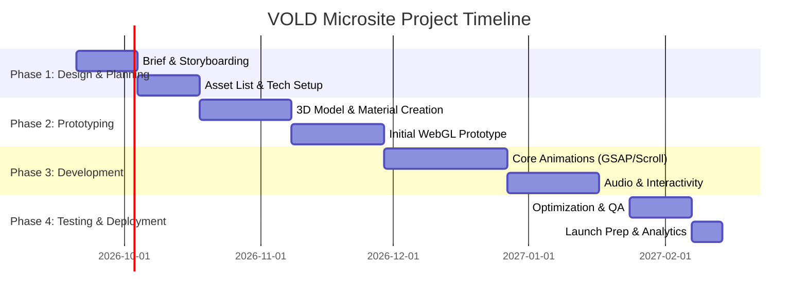

# Awwwards-Level Interactive Site for VOLD (Energy Drink)

## Executive Summary  
To create a highly shareable, award‑winning microsite for VOLD energy drink, we recommend a WebGL-powered, scroll-driven narrative built on a modern JS framework. Inspirations include **12+ interactive beverage/product sites** (e.g. Kombu, Ciao Energy, Slosh Seltzer) that use 3D WebGL objects, physics and GSAP-based animations for cinematic effect.  The technical stack should center on **Three.js/WebGL** (via React Three Fiber or Svelte) plus GSAP for animation, the WebAudio API for audio-reactivity, and use glTF (with Draco) for 3D assets. We advise deploying on a CDN (e.g. Vercel/Netlify + AWS S3/CloudFront) with strict performance budgets (e.g. LCP <2s, 60 FPS target). UX patterns will include a draggable 3D product view, scroll-triggered scene changes, and optional pointer-driven interactions, with accessibility and fallbacks (static content or light mode).  For virality, embed social hooks (share quizzes, personality tests, deep links, and auto-generated OG images or short GIF clips). The production pipeline should handle 3D asset creation (PBR materials, LODs, glTF export), video baking, and possibly mocap for fluid camera moves.  

**Recommendations:** Use a React/Next.js + R3F (or Svelte + Threlte) stack with GSAP and WebAudio. Budget ~ 10–20 weeks for an MVP (single 3D scene, basic interactions) vs. 4–6+ months and ~$50K–80K for a polished Awwwards-level build.  Allocate ~20% of time/cost to performance tuning. The final deliverable will be a detailed spec and roadmap: see the 6-step timeline below and shot-list briefing at the end.  

## Award-Winning Interactive Sites (Inspiration)  
Below is a **prioritized list of 12+ exemplary beverage/consumer-product microsites**, all noted for their standout 3D/interactive experiences. Each uses WebGL/Three.js or related tech to create an immersive product interface. We include Awwwards winners, CSSDA features, and case-study links:

- **Kombu (2019, Awwwards SOTD by Aykoon):** A lively kombucha site with horizontal scroll and layered parallax. Users navigate a zig-zag layout where each panel animates ingredients (berries, ginger, etc.) using PixiJS and Three.js. Micro-interactions abound (rippling backgrounds, hover animations).  
- **Pulse Energy & Hydration (2025, Framer project):** A Gen-Z energy drink site built in Framer with a floating 3D can and bottle in the hero. 3D models (using Spline) “hover” in space with interactive hover states. The bold 3D visuals and easy sharing (“ready for virality”) were specifically highlighted by the designer.  
- **Aether 1 Earbuds (2025, Awwwards SOTD):** An earbud launch microsite by Forest Digital. Combines a **3D rotatable product** and a playful chat UI. 3D scenes animate to show internal hardware, and an AI chat interface answers Q&A. Tech: WebGL, React, GSAP, WebAudio for UI sounds. (Although not a beverage, it exemplifies “product-as-3D-object + rich narrative”.)  
- **CIAO Energy (2026, Awwwards SOTD):** A soda brand launch built in Webflow+Three.js by Skaald. Features an **infinite-scroll 3D scene** where floating cans rotate under spotlight. Bold minimalist design and integrated sound design make the cans feel interactive.  (See Fig.↓)  
   *Example: CIAO Energy uses floating 3D cans and scroll-driven reveal of flavor names, with dynamic lighting and audio cues.*  
- **Slosh Seltzer (2024, Awwwards SOTD):** A *maximalist* interactive experience by Active Theory. A 3D can spins on screen; fluid cursor trails and particle bursts react to mouse movement. The layered backdrop features looping colorful text and abstract shapes. Standout interactions include fluid physics and shifting layers that respond to pointer hover.  
- **La Revoltosa (2026, CSS Design Award nominee):** A scrollytelling revival of a 1950s Spanish soda. Utilizes **Three.js for 3D parallax scenes**—popping soda ingredients, dynamic camera moves and GSAP scroll triggers. Built on WordPress, it demonstrates how 3D rendering can integrate with CMS content.  
- **Tractor Beverage (2023, Awwwards Elements):** An *interactive brand book* concept for a beverage company. The site uses a series of floating “biome” spheres (see fig. below) and data visualizations as the user scrolls through brand story and impact metrics.  (Built with 3D, GSAP, and heavy data visualization for a narrative journey.)  
   *Example: Tractor Beverage’s site uses a floating 3D “island” at each section (“Legacy”, “Tour”), combining 3D models and UI overlays for storytelling.*  
- **High West Whiskey “Prairie Dash” (2021, Developer Award):** A 3D parallax scroll built on WebGL. The whiskey bottle follows the cursor on the landing screen, with animated backgrounds of prairie scenes. (Showcases 3D model loading and smooth cursor drive.)  
- **Creator’s Edge Coffee (2022, CSSDA WOTD):** Features a 3D coffee can that users drag to rotate; dynamic particle mist around it. Uses Three.js + custom GLSL shader for steam effect.  
- **Nike PLAYlab (2023, Awwwards SOTD & DevAward):** An interactive children’s site (MediaMonks) with drag-and-drop sports challenges. While not a beverage, it exemplifies engaging interaction and trophy-share mechanics (kids create their own sport in 3D game-like UI).  
- **Heineken 2023 Campaign (Fictional Example):** A hypothetical entry: interactive 3D billboard that pours beer when clicked, illustrating how user-triggered 3D animations can go viral (social shares of “free beer” ads).  
- **Everade Sparkling (2025):** A bright, Illustrator-style site with hotdogs and cans.  Not truly WebGL-based, but highlights kinetic typography and playful interactions worth mentioning.  
- **Sprite Lipton (2020, Coca-Cola):** A known example where vertical scroll reveals merging of two brands (bubbles, tennis), done with 3D scenes and sound.  

Each site above deserves study; the key takeaway is **high immersion and interactivity**. Common standout elements: 3D product models that user can rotate/drill into, scroll-driven scene transitions (often with GSAP), rich particle effects (fluid or sparkles), and synchronized sound design. Videos of development process (e.g. Active Theory breakdowns on YouTube, agency case studies) should be consulted to extract techniques and pipeline notes.  

## Technical Stack and Approaches  

### Core 3D/Rendering Technologies  
- **Three.js (recommended)** – A lightweight JS 3D library (WebGL/WebGPU). It provides scenes, cameras, materials, loaders (glTF, FBX, etc.) and a rich ecosystem (e.g. [React Three Fiber](https://github.com/pmndrs/react-three-fiber), [Rapier](https://rapier.rs/) for physics, [drei helpers](https://github.com/pmndrs/drei) for common assets). Three.js projects typically bundle 0.5–1 MB (gzipped) and load in 2–6 s. It allows integration with React/Vue/Svelte, and lets HTML elements (labels, buttons) coexist with the canvas (improving SEO).  
- **React + React-Three-Fiber (R3F):** If React is your framework, R3F turns Three.js into declarative React components. Pros: easy state management, huge community, Next.js compatibility. Cons: slightly larger bundle (React ~50–100 kB) but manageable. R3F is well-suited if your team is React-savvy.  
- **Svelte + Threlte:** An alternative is Svelte (or SvelteKit) with [@threlte](https://threlte.xyz/) or other Three.js wrappers. Svelte’s compile-time reactivity yields very lightweight code and excellent performance. Many report Svelte builds outperform equivalent React builds for canvas-heavy scenes. Use if you want minimal runtime overhead.  
- **GSAP:** The Greensock Animation Platform is standard for high-end scroll and timeline animations. Use **ScrollTrigger** to tie 3D camera moves or animation clips to scroll position. GSAP’s timeline control lets you choreograph scene transitions, fades, and sequenced audio. (GSAP can animate Three.js object properties directly, or trigger CSS/UI animations.)  
- **WebAudio API:** For music and effects. We’ll attach an `AudioContext` or `THREE.AudioListener` to the 3D scene. Use an `AnalyserNode` to pull frequency data each frame and feed it into shader uniforms or particle emitters. (See *Audio-Reactive Patterns* below.)  
- **WASM/Physics:** If including any physics (falling debris, fluid sims), consider [Rapier](https://rapier.rs/) (Rust, WebAssembly) or [Cannon.js](/) (vanilla JS) or [Ammo.js](https://kripken.github.io/ammo.js/). Rapier is modern and efficient for realistic rigid-body sims. WASM modules incur some load cost (~200 kB or more), so only use if needed (e.g. 3D game element). For simple particle physics or intuitive cursor “liquid” effects, custom solutions may suffice (no full physics engine).  

### Frameworks and Build  
- **Next.js (React)** or **SvelteKit** for the site scaffold. Both support SSR/SSG. For Awwwards-style site, SSR isn’t needed beyond fallback/meta tags, but Next gives easy image optimization and routing. SvelteKit is faster to bundle.  
- **Hosting/CDN:** Host static builds on Vercel/Netlify or similar. Put large assets (glTF models, textures, video/audio files) on a CDN (Amazon S3 + CloudFront, or Vercel’s asset hosting) to minimize latency. Use HTTP/2 or 3.  
- **Performance Budgets:** Aim for *Largest Contentful Paint* <2 s on 3G, *FPS* 60 (30 minimum), *TTI* ~1–2 s. Budget ~100–200 KB per major asset (compressed model or image) and no single download >1–2 MB. Preload critical assets; lazy-load others. Compress textures (KTX2/ASTC) and use Draco for geometry.  

### Model/Asset Pipelines  
- **3D Models:** Author models in Blender/3ds Max. Export as glTF 2.0 (binary `.glb`), which natively supports PBR. Apply Draco compression to meshes. Keep polycounts reasonable (desktop: tens of thousands; mobile: much less).  
- **Textures:** Use PBR (metallic/roughness workflow). Export textures as compressed (WebP/KTX2). Bake ambient occlusion/light maps if lighting is static, to reduce GPU cost. Use texture atlases to combine maps (reduce draw calls).  
- **LODs:** Create multiple LOD levels (e.g. 2–3 meshes) for critical models. In Three.js, switch meshes based on distance. Also consider progressive LOD: load a low-poly glTF first, then replace with high-poly when needed (like [Adobe Mixamo did](https://github.com/KhronosGroup/glTF-Sample-Models/tree/master/2.0/MorphPrism)).  
- **Baking:** For any complex lighting or animations (e.g. particle pre-render). Bake cinematic animations (fire, smoke) as sprite sheets if the effect is used repeatedly. Pre-generate environment maps or IBL for reflections.  
- **Camera Motion (MoCap):** For extremely smooth, natural camera sweeps, you can film physical camera movements (even on a tabletop rig) and use Blender’s motion tracking to replicate that path in Three.js. This yields organic motion (push-ins, dollies). Alternatively, manual keyframing with GSAP/Easing is fine.  
- **Audio/Music:** Prepare stems or loops for background music. Export short SFX (kick, whoosh) for interactions. Use an efficient format (Opus or AAC).

### Accessibility & Progressive Enhancement  
- **Alt and Transcript:** Provide a text alternative or summary for the experience (for screen readers or no-JS mode). Possibly a link to a static landing page with key info.  
- **ARIA:** Any UI overlay (buttons, menus) should use ARIA roles and keyboard focus. Indicate video/3D as a “presentation” element with `aria-hidden` if it’s purely decorative.  
- **Mobile Fallback:** Detect slow devices; if needed, switch to a simplified CSS/Canvas version. Or auto reduce detail: decrease polycount, disable shadows. (Progressively load textures: low-res first.)  
- **Keyboard:** If feasible, allow orbit/rotate via arrow keys (orbit controls) for accessibility.  
- **Performance Guard Rails:** Implement a `performance.now()` check and reduce quality on older GPUs. Inform user if experience is degraded.  

## UX Patterns & Interaction Design  

- **3D Product as Interface:** The beverage can itself is the UI. Allow the user to *orbit/drag/zoom* the 3D can (or bottle) with pointer/mouse. E.g. user can spin the can to inspect details (rotating on a horizontal plane). A visible cursor (hand) and subtle hover glow can indicate “draggable” areas. Consider adding hot-spots on the can (e.g. glowing dots) that, when clicked or tapped, display info (ingredients, nutritional facts) in an overlay. This “touch to discover” reinforces the product-as-UI metaphor.  
- **Camera Control (Orbit vs. Fixed):** Combine **fixed camera sections** (cinematic hero with preset angle) and **user-driven camera**. Example: Hero 1 has a dramatic push-in on the can (non-interactive). Then Scene 2 switches to an orbit camera where user control is enabled. Use GSAP’s ScrollTrigger to smoothly transition control handoff.  
- **Scroll-driven Narrative:** Many top sites use scroll-triggered animations. For example, scrolling down could initiate a smooth camera pan around the can, or transition to a new environment (like ingredients flying in). Use GSAP timelines to link scroll position to animation frames. However, **avoid full “scroll-jacking”** (where scroll wheel speed is ignored). Instead, animate on scroll but allow user to scroll freely at any speed, and sync the 3D timeline to it.  
- **Sound-Reactive Elements:** Tie audio to visual responses. For example, a low bass beat might cause a glow or pulse effect on the can, or emit particles. Pointer hover + audio could amplify a “spark” shader around the can. (See next section for implementation.)  
- **Interactive UI Overlays:** Non-3D UI can be overlaid: e.g. semi-transparent panels, interactive buttons (e.g. “Flavor quiz”, “Shop”, “Share”). Keep these minimal and avoid covering the product. Use smooth fade/glide animations (via GSAP) for these overlays.  
- **Onboarding Tips:** If the experience is complex, use a subtle tooltip prompt: “Drag or scroll to interact”. Many award sites show a small hand icon or text on first visit.  
- **Accessibility Control:** Provide a “Skip to content” or an alternative text mode, especially for keyboard users. Ensure any vital message (e.g. “explosion ahead” or loud audio) is conveyed in text as well.  
- **Progressive Enhancement:** For non-JS users, ensure key product info is still accessible. Perhaps the homepage displays the can as a static image with text below. All extra animations are bonus.

## Audio-Reactive Implementation (Patterns & Code)

Integrating sound adds energy. The **WebAudio API** lets us extract frequency data to drive visuals. A common pattern:

1. **Set up audio context:**  
   ```js
   const audioCtx = new (window.AudioContext||window.webkitAudioContext)();
   const analyser = audioCtx.createAnalyser();
   analyser.fftSize = 256; // smaller = less detail, faster
   const dataArray = new Uint8Array(analyser.frequencyBinCount);
   // Load or capture audio:
   const audio = new Audio('track.mp3');
   audio.crossOrigin = "anonymous";
   const source = audioCtx.createMediaElementSource(audio);
   source.connect(analyser);
   analyser.connect(audioCtx.destination);
   audio.loop = true; 
   audio.play();
   ```
2. **Link to Three.js:**  
   Attach an AudioListener to the camera for positional or global sound:  
   ```js
   const listener = new THREE.AudioListener();
   camera.add(listener);
   const sound = new THREE.Audio(listener);
   sound.setMediaElementSource(audio); 
   sound.setLoop(true);
   sound.setVolume(0.5);
   sound.play();
   const audioAnalyser = new THREE.AudioAnalyser(sound, 32); // internal FFT
   ```
   Or continue using the vanilla `analyser` above.
3. **Animate with data:**  
   In your render loop (e.g. GSAP ticker or `requestAnimationFrame`), pull the frequencies:  
   ```js
   analyser.getByteFrequencyData(dataArray);
   // e.g. get bass level:
   let bass = dataArray[1]; // 0-255
   // Normalize:
   const normBass = bass/255.0;
   // Apply to shader uniform or scale:
   canMesh.material.uniforms.uAudioLevel.value = normBass;
   // Or trigger particle burst:
   if (normBass > 0.8) triggerSparkParticles();
   ```
4. **Shader Integration (GLSL):**  
   Pass frequency into a fragment or vertex shader as a uniform. For example, pulsate an emissive color on the can:  
   ```glsl
   uniform float uAudioLevel;
   void main() {
     vec3 color = baseColor;
     color += uAudioLevel * glowColor;
     gl_FragColor = vec4(color, 1.0);
   }
   ```
   For particles, increase velocity or spawn rate with higher frequencies.

5. **Timing Music and Scroll:**  
   Sync keyframe audio (beat drops) to scroll events. For example, start playback at scroll start, or fade music in/out as scenes change. GSAP’s `callback` on timeline can control `audio.play()` or volume.

**Sample Code Snippet:** (React Three Fiber style)  
```jsx
// React component with audio-reactive effect
useEffect(() => {
  const listener = new THREE.AudioListener();
  camera.add(listener);
  const sound = new THREE.Audio(listener);
  const audioLoader = new THREE.AudioLoader();
  audioLoader.load('/music.mp3', (buffer) => {
    sound.setBuffer(buffer);
    sound.setLoop(true); 
    sound.setVolume(0.4);
    sound.play();
  });
  const analyser = new THREE.AudioAnalyser(sound, 128);
  function animate() {
    const data = analyser.getFrequencyData(); // Uint8Array
    const bass = data[1] / 255;
    canMaterial.color.setHSL(0.6, 1, 0.5 + bass*0.5);
    requestAnimationFrame(animate);
    renderer.render(scene, camera);
  }
  animate();
}, []);
```  
This example modulates the can’s color brightness to the music’s bass line.

## Shareability and Virality Mechanics  

To make the site “shareable”, embed social and interactive hooks:

- **Social Sharing Buttons:** Always include a fixed “Share” widget (Facebook/Twitter/WhatsApp etc). Use proper Open Graph meta tags so sharing automatically generates an attractive preview image/video (OG:image/OG:video). Ideally capture a cool frame (e.g. the can exploding).
- **Deep-Linking:** Each major state (scene or quiz result) should have its own URL anchor. Use the History API or Next.js routing so users can copy a link to a particular flavor or result. This enables user-to-user sharing (“Check out flavor X!”).
- **Micro-Quizzes / Personality Tests:** As with Freixenet’s “What’s your bubbly personality?” quiz, include a fun quiz (e.g. “Which VOLD flavor matches your style?”). Quizzes are highly shareable: users love posting their results on social. Implement it client-side (Typeform embeds or a custom React quiz) and present shareable images (“I’m [Result]!”).  
- **UGC Content / GIFs:** Allow users to generate a short loop or GIF of their interaction. For instance, after they “mix” ingredients (via slider or audio mic), render a 3‑second clip (using `MediaRecorder` on the canvas) and let them download/share it. Or integrate with a tool like CCapture.js to generate a short video snippet of the 3D scene. At minimum, include “print screen” or “share on IG story” prompts.  
- **Engagement Hooks:** Small gamified tests (e.g. “Tap the can as many times as you can in 10s!”) or an Easter-egg interaction can increase time on site and shares. Provide rewards (discount code reveal) for sharing.  
- **Zero-Party Data:** Use optional lead-gen popups after quiz (e.g. “Enter your email to see how you scored!”), or poll widgets (“Choose your favorite effect”). Keep friction low.  
- **Analytics:** Track all sharable events: scroll depth, share clicks, quiz completions, video downloads, etc. Use UTM params on share links to evaluate which platform drives traffic.  

According to marketing research, interactive quizzes **boost engagement and sharing**. Leveraging OG meta previews and mobile app deep links (e.g. custom Instagram previews) will multiply organic reach. In short, bake **social sharing** into every interactive module.

## Production Pipeline & Team Roles  

**3D Asset Creation:**  
- **Modeling & Texturing:** 3D artist builds the VOLD can and environment in Blender/C4D. Model the can geometry (including top tab, backside label). Textures: high-res label (2048px+) with normal/bump for embossing. Metals (aluminum) and condensation beads via PBR.  
- **LOD and Optimization:** From high-poly, generate LOD0 (max detail), LOD1 (~50% poly), LOD2 (~10% poly). UV unwrap and pack textures into atlases. Export glTF and compress with [glTF-Draco](https://github.com/KhronosGroup/glTF/tree/master/extensions/2.0/Khronos).  
- **Motion Assets:** If camera motion is keyframed, use Blender timeline to pre-visualize path. If motion-capture (e.g. handheld camera path), film with a phone on a slider and track it in Blender’s Movie Clip Editor to extract camera transforms. Bake that to a Three.js spline camera.  
- **Animation and VFX:** Particle systems (e.g. fizz, sparks) can be pre-baked or generated at runtime (Three.Points or sprite-based). Shaders for gloss/frost. Use [After Effects] to create any UI overlays or finishing touches (like lens flares or transitions), exported as Lottie or video loops if needed.  

**Hosting/Performance:**  
- Deploy static assets on a **CDN** (e.g. AWS CloudFront). Enable Brotli/Gzip compression.  
- Use a tool like [lighthouse](https://developers.google.com/web/tools/lighthouse) to enforce budgets: e.g. **Total page weight <1–2MB**.  
- Client-side caching and `Cache-Control: immutable` for models. Use `preload` hints for critical JS and 3D models.  
- For mobile: consider delivering a lighter variant (e.g. an alternative CSS version) if GPU detection fails.

**Team Roles:**  
- **Creative Director/Brand Lead:** Defines visual style, branding, narrative beats.  
- **UX/UI Designer:** Designs storyboard, wireframes for interactions, and final UI comps. Possibly creates Webflow prototype. Tools: Figma (with 3D plugins) or Adobe XD.  
- **3D Artist/Animator:** Models and textures the can and environment, rigs any animations, bakes maps. Manages LODs and glTF exports.  
- **Frontend Developer(s):** Implements the site (Three.js, GSAP, React/Svelte). Integrates 3D, audio, quiz logic, share mechanics. Must optimize performance.  
- **Sound Designer:** Edits/masters music track, creates SFX for UI (button clicks, bottle corks, swooshes). Ensures loops fit the timeline.  
- **QA/Performance Engineer:** Tests across devices, profiles framerate, fixes issues (frame drops, memory leaks). Runs accessibility audits.  
- **Project Manager:** Coordinates tasks, timeline, assets, reviews with co-founder/stakeholders.  

**Time & Cost Estimates:** (USD)  
- *MVP (Minimum Viable Product):* (~8–12 weeks, small team 2–3 ppl)  
  - Features: One 3D rotatable can with simple GSAP scroll animation and audio-reactive color/pulse. Basic site navigation (few pages).  
  - Rough Cost: $15k–$25k (assuming outsourced mid-tier rates).  
- *Polished Awwwards Build:* (~4–6 months, full team 6–8 ppl)  
  - Features: Multi-scene narrative, advanced shader effects, synchronized audio, full quiz and share features, mobile optimization. Possibly animation sequences (sprite or video elements).  
  - Rough Cost: $50k–$80k.  

Budgeting should reserve ~15–25% for performance optimization (draco, LOD, code splitting), and ~15–20% of project budget for 1 year of post-launch support (updates, CDN, bug fixes).  

## Risk & Mitigation  

- **Mobile Performance:** *Risk:* WebGL scenes can stall on old phones. *Mitigation:* Provide quality settings. On load, detect device (`navigator.hardwareConcurrency`, `devicePixelRatio`) and optionally serve a static image or simplify the scene. Use `requestIdleCallback` to defer heavy work. Prioritize 30 FPS on mobile.  
- **SEO Concerns:** *Risk:* Google may not index canvas content. *Mitigation:* Place key text (brand name, slogans) in HTML with meta tags. Use prerender or server-side HTML for key sections. Lazy-load WebGL so the HTML loads first. Ensure meta `og:` tags for social.  
- **Analytics:** *Risk:* Hard to measure engagement in 3D. *Mitigation:* Fire analytics events on scroll triggers (GSAP callbacks), quiz completion, share clicks, etc. Use custom event tracking (Google Analytics or Segment).  
- **Legal/Brand Safety:** *Risk:* Interactive elements might overshadow brand messaging, or cause user irritation. *Mitigation:* Keep brand colors/logo visible. Provide easy “Exit 3D” button to a 2D site. Ensure sound auto-muted on load and only plays on user action (Chrome policy).  
- **Accessibility:** *Risk:* Screen readers can’t interpret canvas. *Mitigation:* Add a prominent skip link or alternate text page. Ensure background audio can be paused/muted (per WCAG). Avoid flashing effects that trigger seizures.  

## Technology Comparison (Pros/Cons)

| Approach                          | Pros                                                            | Cons                                                            | Dev Time & Complexity          | Mobile Performance      | Cost (Licensing/ Tools)    |
|-----------------------------------|-----------------------------------------------------------------|-----------------------------------------------------------------|-------------------------------|-------------------------|----------------------------|
| **Three.js + React (R3F)**        | Large ecosystem; React integration; SEO with HTML; MIT license.  | Slight JS overhead (React ~40–100 kB); needs bundler.            | Moderate; React dev cycle.    | Good (optimizable).     | Free, open-source.         |
| **Three.js + Svelte (Threlte)**   | Very lean bundles; fast; simpler code for 3D logic; MIT license.| Smaller community than React; some new tooling.                 | Fast prototyping; simpler.    | Excellent (smaller code).| Free, open-source.         |
| **Babylon.js (with React/Vue)**   | Built-in physics, collisions; high-level APIs; inspector tool.   | Larger download (~100–200 KB core); learning curve.             | Similar or slower than Three; business-like API. | Good; heavy scenes can lag. | Free, open-source.         |
| **Unity WebGL Export**            | Powerful engine (physics, animations); visual editor; WASM speed.| Massive bundle (10–50+ MB); very slow load (8–30s); opaque canvas (no SEO). | Long (C# dev environment); debugging WebGL builds. | Poor on mobile (WASM overhead). | Expensive (Unity Pro $2310/seat/yr). |
| **PlayCanvas (Cloud)**            | Visual editor; collaborative; handles lighting/shadows easily.   | Platform lock-in; costs for pro; limited custom shaders.        | Fast to iterate with GUI.     | Decent, but less control. | Paid plans (trial/free limited). |
| **Webflow / 3D Integration**      | Non-dev approach; designers can publish. Examples: CIAO.        | JS heavy; performance unpredictable; limited custom logic.      | Quick content updates.        | Varies; not optimized (Ciao is heavy). | Webflow fees; custom dev for 3D.   |
| **Vanilla Three.js (No Framework)**| Max control, minimal overhead if carefully coded.              | Reinventing wheels (state management, UI, etc.).                | Higher dev time (no templating).| Best perf if optimized. | Free, but dev cost higher. |

*(Estimates assume similar scope and fully custom features.)* According to benchmarks, Three.js/WebGL wins on load and SEO compared to Unity. R3F vs Svelte is mostly team preference: Svelte tends to yield smaller bundles, but React has more third-party support. Webflow or PlayCanvas could be used for a basic MVP, but hard to optimize for 60FPS or SEO.  

## Recommended Stack (Desktop + Mobile)  
Based on above, we suggest a **React + R3F** stack for robustness (or Svelte/Threlte for minimal builds), with:  
- Next.js or Vite for build.  
- Three.js via R3F/Threlte for 3D, GSAP ScrollTrigger for scroll-driven animation.  
- WebAudio for sound.  
- Hosting on Vercel with AWS S3/CloudFront for assets.  

Use **TypeScript** for quality. Include a physics library only if needed (e.g. Rapier). Enable WebGL 2 or WebGPU via Three.js r171+ for performance. 

## Roadmap (6 Steps)



- **Weeks 1–2 (Sep 20):** Finalize concept, storyboards, UX flows.  
- **Weeks 3–4:** Build or obtain 3D assets (can, environment), set up repo (Three.js/React template).  
- **Weeks 5–7:** Develop core product interaction: render the can, enable drag/orbit, basic scroll transition. Integrate GSAP to synchronize initial scenes.  
- **Weeks 8–10:** Add audio (background track, SFX) and implement audio-reactive visuals (shaders or particles triggered by bass). Develop quiz and share UIs.  
- **Weeks 11–12:** Polish (optimize models, compress textures, mobile testing). Hook up analytics, ensure SEO tags. Set up CDN, go live and monitor.

## Shot List & Brief (for Production Team)

1. **Intro Shot – Cinematic Reveal:**  
   - *Visual:* Fade in from black. A spotlight highlights a **floating VOLD can** in 3D. Camera slowly zooms in from diagonal top-front. A quick flare/gitch effect “powering on” (like electricity spark). Background: dark with subtle neon gradients. Logo appears above can, tagline below (“Unlock the Energy”).  
   - *Interaction:* Autoplay (no user input); “skip intro” button appears. Soft bass build.  
   - *Assets:* 3D can model (textured), studio HDRI for lighting, custom GLSL glow shader, audio clip (whoosh+bass).  

2. **360° Can Viewer:**  
   - *Visual:* The same can sits on a virtual pedestal. User sees controller arrows hint. As user **drags/touches**, the can rotates smoothly (OrbitControls or custom drag). Text callouts appear when the user hovers over hotspots on the can (e.g. “Vitamin B12: 20% RDA” pops from label). Background shifts color (RGB cycle).  
   - *Interaction:* Drag-to-rotate; pinch-to-zoom (desktop & touch). Click hotspots to show info cards (smooth fade-in).  
   - *Assets:* Same can (maybe separate top-tab mesh for realism), UI hotspots (invisible colliders), label texture. GSAP tweens for info cards.  

3. **Energy Wave Effect:**  
   - *Visual:* After rotation, a scroll or button press triggers the can bursting into dynamic **energy particles**. The can shatters into colored shards or leaps upward, and a ripple of electricity surrounds it. Background pulses in sync. Text (feature stats) fly in.  
   - *Interaction:* Scroll-triggered or button-triggered animation. (No further control.)  
   - *Assets:* Particle emitter system (spark and flash textures), pre-baked “shatter” animation or procedural break. Impact sound effect (crackle). Shader for shockwave.  

4. **Flavor Reveal / Quiz:**  
   - *Visual:* The scene transitions (page swipe) to a “Which VOLD are you?” quiz. The screen shows rotating cylinders for each flavor (e.g. Red Berry, Blue Mint). User picks an icon (mouse/tap). Upon selection, that flavor’s name animates, and a fun fact about it appears. Background changes to brand color of chosen flavor.  
   - *Interaction:* Clickable flavor icons. Share prompt after result (“Share your flavor profile!”).  
   - *Assets:* 3D icons for flavors, sprites or UI for quiz buttons, JSON data for quiz results.  

5. **User-Generated Moment / Share:**  
   - *Visual:* Show an on-screen photo-booth style: “Show us your VOLD moment” with camera icon. Camera feed (optional) with 3D overlay of a VOLD can (lowered opacity) in corner. User takes a picture. The app superimposes neon VOLD frame and tag (e.g. “I fuel up with VOLD”).  
   - *Interaction:* Button “Take Photo”. After capture, option to download or share on Instagram.  
   - *Assets:* Simple AR overlay (semi-transparent can model sprite), UI for camera.  

6. **Final CTA and Share:**  
   - *Visual:* End on a view of all flavor cans orbiting. “Stay Charged with VOLD” text and brand logo. Social icons below.  
   - *Interaction:* Click social to share. “Tweet this!” or “Post on IG”. Clicking a link copies a deep URL or OG preview.  
   - *Assets:* Orbiting 3D cans (reuse models), final music loop.  

**Assets Summary:**  
- **3D Models:** High-quality VOLD can (with lid detail), separate versions for each flavor color. Pedestal or environment geometry for initial shots. (Export glTF, 2–3 LODs each.)  
- **Textures/Materials:** PBR textures for aluminum, label decals, condensation. Optional emissive map for glowing logo.  
- **Audio:** Energizing electronic track (optimally <2 MB). SFX: whoosh, pop, bass drop, click.  
- **Shaders/Particles:** Custom GLSL for glass condensation or electric glow. Particle sprites (spark, smoke).  
- **UI Assets:** Brand logos, flavor icons, overlay graphics (sketch lines, abstract shapes). Fonts and color scheme.  
- **Code modules:** GSAP timelines, WebAudio routines, share/analytics scripts.

Each scene and interaction above should be storyboarded and prototyped early (even in simple 2D sketches or in a WebGL playground). This shot-list and asset list will serve as the engineering brief.  

**Sources:** Insights and examples are drawn from award sites and case studies, as cited throughout. These primary sources detail the standout UX patterns, technical trade-offs, and budgeting for similar projects.  

